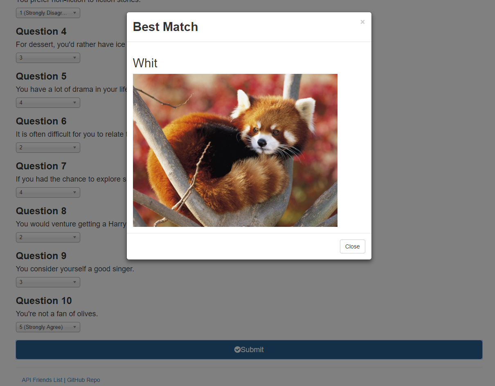

# FriendFinder
Created a full stack application to find the best match between the user and previously stored person data. The user inputs basic information about him/herself and answers a survey. Based on the user's answers, the best match will pop up in a modal. JavaScript logic in apiRoutes.js determines the best match.

View application here: https://whit-friend-finder.herokuapp.com/

**Technology used:** Node.js, Express, JavaScript, HTML, and CSS.

- - - 

Below are screenshots of the application:
### Application Start

### Survey Page

### Best Match Modal

